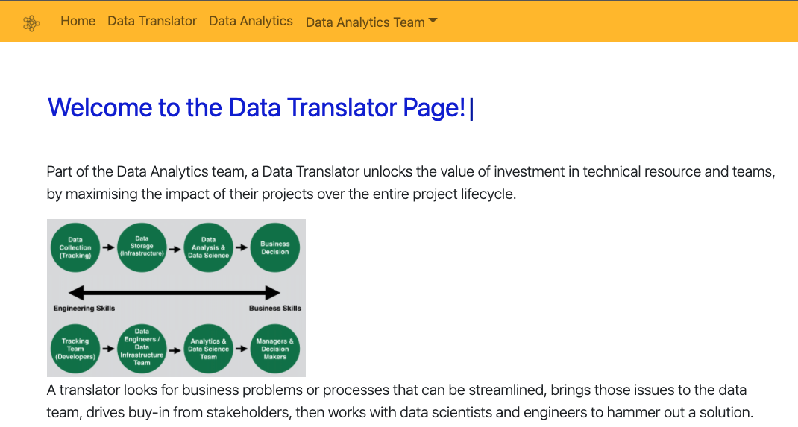

# dataTranslator

## Table of Contents

- [Description](#description)
- [Installation](#installation)
- [Technologies Used](#technologies)
- [Link](#link)

## Description

Usng React to build an informative site on Data Translator.

## Installation

The following steps were undertaken to create this program

- Create and download the repository in gitHub
- Open VS Code
- Execute Create React App: Run npx create-react-app
- React downloads many dependencies. Download the following dependencies

  - bootstrap
  - jquery
  - Node-sass
  - react dom
  - react-bootstrap

- 'npm start' in the command line

## Technologies

This application uses the following packages:

- [React.js](https://reactjs.org/)
- [Javascript](https://www.javascript.com/)
- [Bootstrap](https://getbootstrap.com/)
- [HTML](https://developer.mozilla.org/en-US/docs/Web/HTML)
- [CSS](https://developer.mozilla.org/en-US/docs/Web/CSS)

## Link

You can see the link of this app [LINK](https://peaceful-dawn-51992.herokuapp.com/)

You can view the GitHub here [GITHUB](https://github.com/10-kp/dataTranslator)
